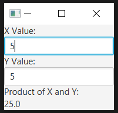

## result


**view**
```xml
<?xml version="1.0" encoding="UTF-8"?>

<?import java.lang.*?>
<?import java.util.*?>
<?import javafx.scene.*?>
<?import javafx.scene.control.*?>
<?import javafx.scene.layout.*?>

<VBox xmlns:fx="http://javafx.com/fxml/1" fx:controller="bindingexercise5.FXMLDocumentController">
    <Label text="X Value:" />
    <TextField fx:id="txtXval" />
    <Label text="Y Value:" />
    <TextField fx:id="txtYval" />
    <Label text="Product of X and Y:" />
    <Label fx:id="lblResult" />
</VBox>
```

**controller**
```java
package bindingexercise5;

import java.net.URL;
import java.util.ResourceBundle;
import javafx.beans.InvalidationListener;
import javafx.beans.Observable;
import javafx.event.ActionEvent;
import javafx.fxml.FXML;
import javafx.fxml.Initializable;
import javafx.scene.control.Label;
import javafx.scene.control.TextField;

public class FXMLDocumentController implements Initializable {

    @FXML
    private TextField txtXval, txtYval;

    @FXML
    private Label lblResult;

    @FXML
    private void handleButtonAction(ActionEvent event) {

    }

    private void product() {
        double x = Double.parseDouble(txtXval.getText());
        double y = Double.parseDouble(txtYval.getText());

        double product = x * y;

        lblResult.setText(String.valueOf(product));
    }

    @Override
    public void initialize(URL url, ResourceBundle rb) {
        txtXval.textProperty().addListener(new InvalidationListener() {
            public void invalidated(Observable obs) {
                product();
            }
        });

    }

}
```