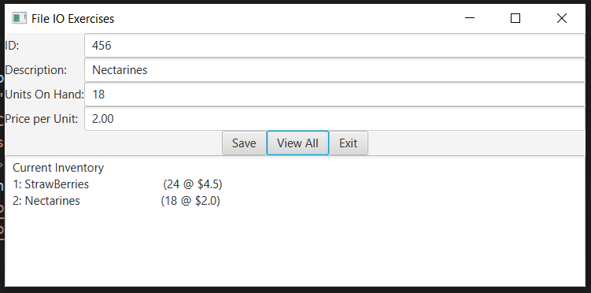

## FXMLDocument.fxml
```xml
<?xml version="1.0" encoding="UTF-8"?>

<?import java.lang.*?>
<?import java.util.*?>
<?import javafx.scene.*?>
<?import javafx.scene.control.*?>
<?import javafx.scene.layout.*?>

<GridPane xmlns:fx="http://javafx.com/fxml/1" fx:controller="fileioexercise.FXMLDocumentController">
  <columnConstraints>
    <ColumnConstraints hgrow="NEVER" />
    <ColumnConstraints hgrow="ALWAYS" />
  </columnConstraints>
    <children>
      <Label text="ID:" GridPane.rowIndex="0" GridPane.columnIndex="0" />
      <TextField fx:id="txtId" GridPane.rowIndex="0"
          GridPane.columnIndex="1" />
      <Label text="Description:" GridPane.rowIndex="1"
          GridPane.columnIndex="0" />
      <TextField fx:id="txtDesc" GridPane.rowIndex="1"
           GridPane.columnIndex="1" />
      <Label text="Units On Hand:" GridPane.rowIndex="2"
           GridPane.columnIndex="0" />
      <TextField fx:id="txtUnits" GridPane.rowIndex="2"
          GridPane.columnIndex="1" />
      <Label text="Price per Unit:" GridPane.rowIndex="3"
          GridPane.columnIndex="0" />
      <TextField fx:id="txtPrice" GridPane.rowIndex="3"
          GridPane.columnIndex="1" />
      <HBox GridPane.rowIndex="4" GridPane.columnIndex="0"
          GridPane.columnSpan="2" alignment="CENTER">
        <Button fx:id="btnSave" text="_Save" onAction="#save" />
        <Button fx:id="btnView" text="_View All" onAction="#view" />
        <Button fx:id="btnExit" text="E_xit" onAction="#exit" />
      </HBox>
      <TextArea fx:id="txtOutput" GridPane.rowIndex="5" GridPane.columnIndex="0"
            GridPane.columnSpan="2" wrapText="true" prefColumnCount="50"
            prefRowCount="7" editable="false" maxWidth="Infinity"
            maxHeight="Infinity" />
    </children>
</GridPane>
```

## FXMLDocumentController.java
```java
package fileioexercise;

import java.io.File;
import java.io.RandomAccessFile;
import java.net.URL;
import java.util.ResourceBundle;
import javafx.event.ActionEvent;
import javafx.fxml.FXML;
import javafx.fxml.Initializable;
import javafx.scene.control.TextArea;
import javafx.scene.control.TextField;

public class FXMLDocumentController implements Initializable {

    final int RECORD = 86;
    int id;
    String desc;
    int units;
    double price;

    @FXML
    private TextField txtId, txtDesc, txtUnits, txtPrice;
    
    @FXML
    private TextArea txtOutput;

    @FXML
    private void save(ActionEvent event) {
        id = Integer.parseInt(txtId.getText());
        desc = txtDesc.getText();
        units = Integer.parseInt(txtUnits.getText());
        price = Double.parseDouble(txtPrice.getText());

        try {
            RandomAccessFile raf = new RandomAccessFile(new File("./src/data/data.txt"), "rw");
            raf.seek(raf.length());
            raf.writeInt(id);
            int s = 35 - desc.length();
            for (int i = 0; i < s; i++) {
                desc += " ";
            }
            raf.writeChars(desc);
            raf.writeInt(units);
            raf.writeDouble(price);
            raf.close();

        } catch (Exception e) {
        }

    }

    @FXML
    private void view(ActionEvent event) {
        String result = "Current Inventory\n";
        try {
            RandomAccessFile raf = new RandomAccessFile(new File("./src/data/data.txt"), "rw");
            long numRec = raf.length() / RECORD;
            raf.seek(0);

            for (int j = 0; j < numRec; j++) {
                id = raf.readInt();
                desc = "";
                for (int i = 0; i < 35; i++) {
                    desc += String.valueOf(raf.readChar());
                }
                units = raf.readInt();
                price = raf.readDouble();
                result+=(j+1)+": " + String.format("%-35s",desc) + "("+units+" @ $"+price +")\n";
            }
            raf.close();
        } catch (Exception e) {
        }
        txtOutput.setText(result);
    }

    @FXML
    private void exit(ActionEvent event) {
        System.exit(0);
    }

    @Override
    public void initialize(URL url, ResourceBundle rb) {

    }

}
```