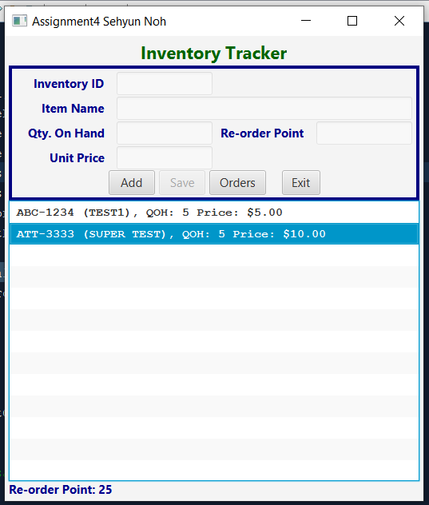
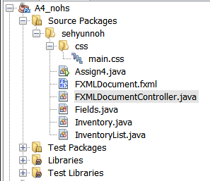

## main.css
```css
/* 
    Created on : 19-Jul-2019, 9:56:43 AM
    Author     : sehyun
*/
.root {
    -fx-padding: 5px;
}

.label {
    -fx-font-weight: bold;
    -fx-text-fill: #00008b;
    -fx-padding-right: 10px;
}

#header {
    -fx-font-size: 22px; /* default : 16 * 1.4 */
    -fx-text-fill: #006400;
}

.text-field {
    -fx-font-family: monospace;
}

.list-view {
    -fx-font-family: monospace;
    -fx-font-weight: bold;
}

#grid-pane {
    -fx-border-width: 4px;
    -fx-border-color: navy;
    -fx-border-style: solid;
/*    -fx-padding: 5px;
    -fx-margin: 5px;*/
}
```

## Assign4.java
```java
package sehyunnoh;

import javafx.application.Application;
import javafx.fxml.FXMLLoader;
import javafx.scene.Parent;
import javafx.scene.Scene;
import javafx.stage.Stage;

/**
 *
 * @author sehyun
 */
public class Assign4 extends Application {
    
    @Override
    public void start(Stage stage) throws Exception {
        Parent root = FXMLLoader.load(getClass().getResource("FXMLDocument.fxml"));
        stage.setTitle("Assignment4 Sehyun Noh");
        Scene scene = new Scene(root);
        
        stage.setScene(scene);
        stage.show();
    }

    /**
     * @param args the command line arguments
     */
    public static void main(String[] args) {
        launch(args);
    }
    
}
```

## FXMLDocument.fxml
```xml
<?xml version="1.0" encoding="UTF-8"?>

<?import java.net.URL?>
<?import javafx.geometry.Insets?>
<?import javafx.scene.control.Button?>
<?import javafx.scene.control.Label?>
<?import javafx.scene.control.ListView?>
<?import javafx.scene.control.TextField?>
<?import javafx.scene.layout.ColumnConstraints?>
<?import javafx.scene.layout.GridPane?>
<?import javafx.scene.layout.HBox?>
<?import javafx.scene.layout.RowConstraints?>
<?import javafx.scene.layout.VBox?>

<VBox id="vbox" alignment="CENTER" prefHeight="582.0" prefWidth="524.0" xmlns="http://javafx.com/javafx/11.0.1" xmlns:fx="http://javafx.com/fxml/1" fx:controller="sehyunnoh.FXMLDocumentController">
    <Label id="header" text="Inventory Tracker" />
    <GridPane id="grid-pane" hgap="5.0" prefHeight="218.0" prefWidth="513.0" vgap="5.0">
        <columnConstraints>
            <ColumnConstraints hgrow="SOMETIMES" minWidth="10.0" prefWidth="100.0" />
            <ColumnConstraints hgrow="SOMETIMES" minWidth="10.0" prefWidth="100.0" />
            <ColumnConstraints hgrow="SOMETIMES" minWidth="10.0" prefWidth="100.0" />
            <ColumnConstraints hgrow="SOMETIMES" minWidth="10.0" prefWidth="100.0" />
        </columnConstraints>
        <rowConstraints>
            <RowConstraints minHeight="10.0" prefHeight="30.0" vgrow="SOMETIMES" />
            <RowConstraints minHeight="10.0" prefHeight="30.0" vgrow="SOMETIMES" />
            <RowConstraints minHeight="10.0" prefHeight="30.0" vgrow="SOMETIMES" />
            <RowConstraints minHeight="10.0" prefHeight="30.0" vgrow="SOMETIMES" />
            <RowConstraints minHeight="10.0" prefHeight="30.0" vgrow="SOMETIMES" />
        </rowConstraints>
        <children>
            <Label text="Inventory ID" GridPane.columnIndex="0" GridPane.halignment="RIGHT" GridPane.rowIndex="0">
                <padding>
                    <Insets right="10.0" />
                </padding>
            </Label>
            <Label text="Item Name" GridPane.columnIndex="0" GridPane.halignment="RIGHT" GridPane.rowIndex="1">
                <padding>
                    <Insets right="10.0" />
                </padding>
            </Label>
            <Label text="Qty. On Hand" GridPane.columnIndex="0" GridPane.halignment="RIGHT" GridPane.rowIndex="2">
                <padding>
                    <Insets right="10.0" />
                </padding>
            </Label>
            <Label text="Unit Price" GridPane.columnIndex="0" GridPane.halignment="RIGHT" GridPane.rowIndex="3">
                <padding>
                    <Insets right="10.0" />
                </padding>
            </Label>
            <Label text="Re-order Point" GridPane.columnIndex="2" GridPane.halignment="RIGHT" GridPane.rowIndex="2">
                <padding>
                    <Insets right="10.0" />
                </padding>
            </Label>
            <TextField fx:id="txtId" GridPane.columnIndex="1" GridPane.rowIndex="0" />
            <TextField fx:id="txtName" GridPane.columnIndex="1" GridPane.columnSpan="3" GridPane.rowIndex="1" />
            <TextField fx:id="txtQoh" GridPane.columnIndex="1" GridPane.rowIndex="2" />
            <TextField fx:id="txtPrice" GridPane.columnIndex="1" GridPane.rowIndex="3" />
            <TextField fx:id="txtRop" GridPane.columnIndex="3" GridPane.rowIndex="2" />
            <HBox alignment="CENTER" spacing="5.0" GridPane.columnSpan="4" GridPane.rowIndex="4">
                <Button fx:id="btnAdd" mnemonicParsing="true" prefHeight="26.0" prefWidth="58.0" text="_Add" />
                <Button fx:id="btnSave" mnemonicParsing="true" prefHeight="26.0" prefWidth="58.0" text="_Save" />
                <Button fx:id="btnOrders" mnemonicParsing="true" prefHeight="26.0" prefWidth="71.0" text="_Orders" />
                <Button fx:id="btnExit" mnemonicParsing="true" prefHeight="26.0" prefWidth="48.0" text="E_xit">
                    <HBox.margin>
                        <Insets left="15.0" />
                    </HBox.margin>
                </Button>
            </HBox>
        </children>
        <padding>
            <Insets bottom="5.0" left="5.0" right="5.0" top="5.0" />
        </padding>
    </GridPane>
    <ListView fx:id="list" />
    <Label id="message" fx:id="lblMessage" prefHeight="18.0" prefWidth="516.0" />
    <stylesheets>
        <URL value="@css/main.css" />
    </stylesheets>
</VBox>
```

## FXMLDocumentController.java
```java
package sehyunnoh;

import java.net.URL;
import java.util.Optional;
import java.util.ResourceBundle;
import javafx.beans.value.ChangeListener;
import javafx.beans.value.ObservableValue;
import javafx.collections.FXCollections;
import javafx.collections.ObservableList;
import javafx.event.ActionEvent;
import javafx.event.EventHandler;
import javafx.fxml.FXML;
import javafx.fxml.Initializable;
import javafx.scene.control.*;

/**
 *
 * @author sehyun
 */
public class FXMLDocumentController implements Initializable {

    @FXML
    private Label lblMessage;

    @FXML
    private TextField txtId, txtName, txtQoh, txtRop, txtPrice;

    @FXML
    private ListView<Inventory> list;

    @FXML
    private Button btnAdd, btnSave, btnOrders, btnExit;

    InventoryList inlist = new InventoryList();

    /**
     * clear all text field
     */
    private void clearAllField() {
        txtId.clear();
        txtName.clear();
        txtQoh.clear();
        txtRop.clear();
        txtPrice.clear();
    }

    /**
     * lock all text field
     *
     * @param lock
     */
    private void lockAllField(boolean lock) {
        txtId.setDisable(lock);
        txtName.setDisable(lock);
        txtQoh.setDisable(lock);
        txtRop.setDisable(lock);
        txtPrice.setDisable(lock);
    }

    /**
     * reset method change to default status
     */
    private void reset() {
        clearAllField();
        lockAllField(true);
        btnAdd.setDisable(false);
        btnSave.setDisable(true);
        btnOrders.setDisable(false);
    }

    /**
     * initialize method
     *
     * @param url
     * @param rb
     */
    @Override
    public void initialize(URL url, ResourceBundle rb) {
        reset();

        btnAdd.setOnAction(new EventHandler<ActionEvent>() {
            @Override
            public void handle(ActionEvent event) {
                btnAdd.setDisable(true);
                lockAllField(false);
                btnSave.setDisable(false);
                btnOrders.setDisable(true);
                txtId.requestFocus();
                lblMessage.setText("");
                list.getItems().clear();
            }
        });

        btnSave.setOnAction(new EventHandler<ActionEvent>() {
            @Override
            public void handle(ActionEvent event) {
                try {
                    if ("".equals(txtId.getText()) || "".equals(txtName.getText())
                            || "".equals(txtQoh.getText()) || "".equals(txtRop.getText())
                            || "".equals(txtPrice.getText())) {
                        throw new IllegalArgumentException("Error: Empty value is not allowed.");
                    }
                    String id = txtId.getText();
                    String name = txtName.getText();
                    int qoh = Integer.parseInt(txtQoh.getText());
                    int rop = Integer.parseInt(txtRop.getText());
                    double sellPrice = Double.parseDouble(txtPrice.getText());
                    Inventory inventory = new Inventory(id, name, qoh, rop, sellPrice);
                    inlist.add(inventory);
                    reset();

                } catch (NumberFormatException e) {
                    Alert alert = new Alert(Alert.AlertType.ERROR);
                    alert.setTitle("Data Entry Error");
                    alert.setHeaderText("Invalid Value Entered");
                    alert.setContentText("Error: mismatch input value");
                    alert.showAndWait();
                } catch (Exception e) {
                    Alert alert = new Alert(Alert.AlertType.ERROR);
                    alert.setTitle("Data Entry Error");
                    alert.setHeaderText("Invalid Value Entered");
                    alert.setContentText(e.getMessage());
                    alert.showAndWait();
                }
            }
        });
        btnOrders.setOnAction(new EventHandler<ActionEvent>() {
            @Override
            public void handle(ActionEvent event) {
                lblMessage.setText("");
                int size = inlist.length();

                if (size == 0) {
                    lblMessage.setText("No items to list. Add some.");
                    lblMessage.setStyle("-fx-text-fill: red;");
                } else {
                    ObservableList<Inventory> obList = FXCollections.observableArrayList();

                    for (int i = 0; i < inlist.length(); i++) {
                        Inventory tmp = inlist.get(i);
                        if (tmp.getQoh() <= tmp.getRop()) {
                            obList.add(tmp);
                        }
                    }
                    if (obList.size() == 0) {
                        lblMessage.setText("No items to re-order.");
                        lblMessage.setStyle("-fx-text-fill: #00008b;");
                    } else {
                        list.getItems().clear();
                        list.setItems(obList);
                    }
                }
            }
        });

        list.getSelectionModel().selectedItemProperty().addListener(new ChangeListener() {
            @Override
            public void changed(ObservableValue observable, Object oldValue, Object newValue) {
                Inventory tmp = list.getSelectionModel().getSelectedItem();
                lblMessage.setText("Re-order Point: " + tmp.getRop());
                lblMessage.setStyle("-fx-text-fill: #00008b;");
            }

        });

        btnExit.setOnAction(new EventHandler<ActionEvent>() {
            @Override
            public void handle(ActionEvent event) {
                String contents = "Are you sure you wish to exit?";
                Alert alert = new Alert(Alert.AlertType.CONFIRMATION,
                        contents, ButtonType.YES, ButtonType.NO);
                alert.setTitle("Exit Program");
                alert.setHeaderText(null);
                Optional<ButtonType> result = alert.showAndWait();

                if (result.get() == ButtonType.YES) {
                    System.exit(0);
                }
            }
        });

    }

}
```

## Fields.java
```java
package sehyunnoh;

/**
 * enum Fields Class
 * @author sehyun
 */
public enum Fields {
    ITEM_ID("Inventory ID"),
    ITEM_NAME("Item Name"),
    QOH("Qty. On Hand"),
    ROP("Re-Order Point"),
    PRICE("Unit Price");

    private String caption;

    public String getCaption() {
        return caption;
    }

    private Fields(String caption) {
        this.caption = caption;
    }
}
```

## Inventory.java
```java
package sehyunnoh;

import java.util.InputMismatchException;

/**
 * Inventory Class
 *
 * @author sehyun
 */
public class Inventory {

    private String id = "ABC-1234";
    private String name = "New Item";
    private int qoh = 0;
    private int rop = 25;
    private double sellPrice = 0;

    /**
     * Empty constructor, assigns default values as initialized by class
     */
    public Inventory() {
    }

    /**
     * Limited constructor, without stock information.
     *
     * @param id the product identification number.
     * @param name the name of the product.
     * @param sellPrice the product's sale price.
     */
    public Inventory(String id, String name, double sellPrice) {
        setId(id);
        setName(name);
        setSellPrice(sellPrice);
    }

    /**
     * Full constructor.
     *
     * @param id the product identification number.
     * @param name the name of the product.
     * @param qoh the quantity-on-hand of the product.
     * @param rop the re-order point of the product.
     * @param sellPrice the product's sale price.
     */
    public Inventory(String id, String name, int qoh, int rop, double sellPrice) {
        setId(id);
        setName(name);
        setQoh(qoh);
        setRop(rop);
        setSellPrice(sellPrice);
    }

    /**
     * ID accessor
     *
     * @return the product identification number.
     */
    public String getId() {
        return id;
    }

    /**
     * ID mutator.
     *
     * @param id the identification number of the product.
     * @throws IllegalArgumentException if ID does not match syntax
     */
    public void setId(String id) {
        if (!id.matches("[a-zA-Z]{3}-[0-9]{4}")) {
            throw new IllegalArgumentException("Error: Inventory ID must be in the form ABC-1234");
        } else {
            this.id = id.toUpperCase();
        }
    }

    /**
     * Name accessor.
     *
     * @return the product's name.
     */
    public String getName() {
        return name;
    }

    /**
     * Name mutator.
     *
     * @param name the name of the product.
     * @throws IllegalArgumentException if user inputs empty name
     */
    public void setName(String name) {
        if ("".equals(name) || name.equals("")) {
            throw new IllegalArgumentException("Error: you must enter an item name.");
        } else {
            this.name = name;
        }
    }

    /**
     * Quantity-on-hand (QOH) accessor.
     *
     * @return the quantity of this product in stock.
     */
    public int getQoh() {
        return qoh;
    }

    /**
     * QOH mutator.
     *
     * @param qoh the quantity-on-hand of the product.
     * @throws InputMismatchException if non-integer is entered
     * @throws IllegalArgumentException if user inputs integer below zero
     */
    public void setQoh(int qoh) throws InputMismatchException {
        if (qoh < 0) {
            throw new IllegalArgumentException("Error: QOH must be 0 or more.");
        } else {
            this.qoh = qoh;
        }
    }

    /**
     * Re-order point (ROP) accessor.
     *
     * @return the quantity of a product before re-order is necessary.
     */
    public int getRop() {
        return rop;
    }

    /**
     * ROP mutator.
     *
     * @param rop the re-order point of the product.
     * @throws InputMismatchException if non-integer is entered
     * @throws IllegalArgumentException if user inputs zero or less
     */
    public void setRop(int rop) throws InputMismatchException {
        if (rop > 0) {
            this.rop = rop;
        } else {
            
        }
    }

    /**
     * Sale price accessor.
     *
     * @return the sale price of the product.
     */
    public double getSellPrice() {
        return sellPrice;
    }

    /**
     * sellPrice mutator.
     *
     * @param sellPrice the sale price of the product
     * @throws InputMismatchException if non-double is entered
     * @throws IllegalArgumentException if user inputs zero or less
     */
    public void setSellPrice(double sellPrice) {
        if (sellPrice <= 0) {
            throw new IllegalArgumentException("Error: Selling price must be greater than 0.");
        } else {
            this.sellPrice = sellPrice;
        }
    }

    @Override
    public String toString() {
//        String format = "%n%s (%s), QOH: %d Price: $%.2f";
//        if (qoh <= rop) {
//            format += "%nYou need to order more %s";
//            return String.format(format, id, name, qoh, sellPrice, name);
//        } else {
//            return String.format(format, id, name, qoh, sellPrice);
//        }

        if (name.length() > 20) {
            return String.format("%s (%s...), QOH: %d Price: $%.2f", id,
                    name.substring(0, 17), qoh,
                    sellPrice);
        } else {
            return String.format("%s (%s), QOH: %d Price: $%.2f", id, name, qoh,
                    sellPrice);
        }
    }

}
```

## InventoryList.java
```java
package sehyunnoh;

import java.util.ArrayList;

/**
 *
 * @author sehyun
 */
public class InventoryList {

    ArrayList<Inventory> invList = new ArrayList<>();

    /**
     * constructor method
     */
    public InventoryList() {
    }

    /**
     * add method
     * @param inventory 
     */
    public void add(Inventory inventory) {
        invList.add(inventory);
    }

    /**
     * get method (get one inventory using index)
     * @param index
     * @return 
     */
    public Inventory get(int index) {
        if (index >= 0 && index < invList.size()) {
            return invList.get(index);
        } else {
            // index is invalid, return null object
            return new Inventory();
        }
    }

    /**
     * get size of arraylist
     * @return 
     */
    public int length() {
        return invList.size();
    }

}
```
