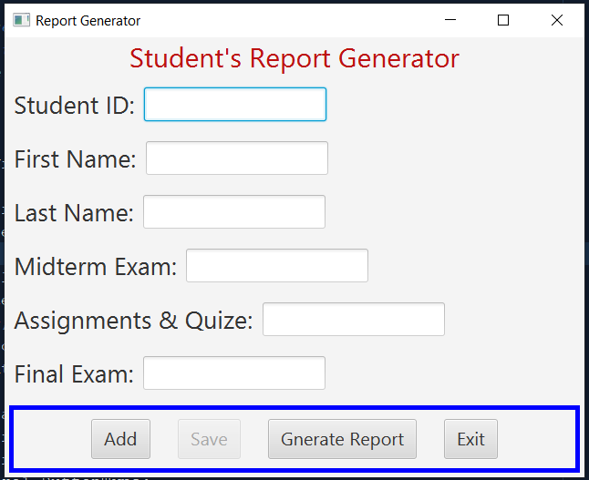

## student.txt
```txt
1234, Muath, Alzghool, 20, 10, 45
8765, Tim, Hortons, 23, 8, 40
```

## report.txt
```txt
NAME                TOTAL
====                =====
Muath Alzghool      75
Tim Hortons         71
```

## FXMLDocument.fxml
```xml
<?xml version="1.0" encoding="UTF-8"?>

<?import javafx.geometry.Insets?>
<?import javafx.scene.control.Button?>
<?import javafx.scene.control.Label?>
<?import javafx.scene.control.TextField?>
<?import javafx.scene.layout.HBox?>
<?import javafx.scene.layout.VBox?>
<?import javafx.scene.text.Font?>

<VBox id="AnchorPane" prefHeight="401.0" prefWidth="636.0" xmlns="http://javafx.com/javafx/8.0.171" xmlns:fx="http://javafx.com/fxml/1" fx:controller="quiz3file.FXMLDocumentController">
   <children>
      <HBox alignment="CENTER" prefHeight="100.0" prefWidth="200.0">
         <children>
            <Label text="Student's Report Generator" textFill="#bc1111">
               <font>
                  <Font size="30.0" />
               </font>
            </Label>
         </children>
      </HBox>
      <HBox prefHeight="50.0" prefWidth="377.0" style="-fx-spacing: 10;">
         <children>
            <Label text="Student ID:">
               <font>
                  <Font size="27.0" />
               </font>
            </Label>
            <TextField fx:id="txtID" alignment="TOP_LEFT">
               <font>
                  <Font size="16.0" />
               </font></TextField>
         </children>
         <VBox.margin>
            <Insets bottom="10.0" left="10.0" right="10.0" top="10.0" />
         </VBox.margin>
      </HBox>
      <HBox layoutX="20.0" layoutY="20.0" prefHeight="50.0" prefWidth="377.0" style="-fx-spacing: 10;">
         <children>
            <Label text="First Name:">
               <font>
                  <Font size="27.0" />
               </font>
               <HBox.margin>
                  <Insets />
               </HBox.margin>
            </Label>
            <TextField fx:id="txtFirst" alignment="TOP_LEFT">
               <font>
                  <Font size="16.0" />
               </font>
            </TextField>
         </children>
         <VBox.margin>
            <Insets bottom="10.0" left="10.0" right="10.0" top="10.0" />
         </VBox.margin>
      </HBox>
      <HBox layoutX="10.0" layoutY="80.0" prefHeight="50.0" prefWidth="377.0" style="-fx-spacing: 10;">
         <children>
            <Label text="Last Name:">
               <font>
                  <Font size="27.0" />
               </font>
               <HBox.margin>
                  <Insets />
               </HBox.margin>
            </Label>
            <TextField fx:id="txtLast" alignment="TOP_LEFT">
               <font>
                  <Font size="16.0" />
               </font>
            </TextField>
         </children>
         <VBox.margin>
            <Insets bottom="10.0" left="10.0" right="10.0" top="10.0" />
         </VBox.margin>
      </HBox>
      <HBox layoutX="20.0" layoutY="160.0" prefHeight="50.0" prefWidth="377.0" style="-fx-spacing: 10;">
         <children>
            <Label text="Midterm Exam:">
               <font>
                  <Font size="27.0" />
               </font>
               <HBox.margin>
                  <Insets />
               </HBox.margin>
            </Label>
            <TextField fx:id="txtMidterm" alignment="TOP_LEFT">
               <font>
                  <Font size="16.0" />
               </font>
            </TextField>
         </children>
         <VBox.margin>
            <Insets bottom="10.0" left="10.0" right="10.0" top="10.0" />
         </VBox.margin>
      </HBox>
      <HBox layoutX="10.0" layoutY="220.0" prefHeight="50.0" prefWidth="529.0" style="-fx-spacing: 10;">
         <children>
            <Label text="Assignments &amp; Quize:">
               <font>
                  <Font size="27.0" />
               </font>
               <HBox.margin>
                  <Insets />
               </HBox.margin>
            </Label>
            <TextField fx:id="txtAssign" alignment="TOP_LEFT">
               <font>
                  <Font size="16.0" />
               </font>
            </TextField>
         </children>
         <VBox.margin>
            <Insets bottom="10.0" left="10.0" right="10.0" top="10.0" />
         </VBox.margin>
      </HBox>
      <HBox layoutX="10.0" layoutY="270.0" prefHeight="50.0" prefWidth="529.0" style="-fx-spacing: 10;">
         <children>
            <Label text="Final Exam:">
               <font>
                  <Font size="27.0" />
               </font>
               <HBox.margin>
                  <Insets />
               </HBox.margin>
            </Label>
            <TextField fx:id="txtFinal" alignment="TOP_LEFT">
               <font>
                  <Font size="16.0" />
               </font>
            </TextField>
         </children>
         <VBox.margin>
            <Insets bottom="10.0" left="10.0" right="10.0" top="10.0" />
         </VBox.margin>
      </HBox>
      <HBox alignment="CENTER" layoutX="10.0" layoutY="320.0" prefHeight="50.0" prefWidth="529.0" style="-fx-spacing: 10; -fx-border-style: solid; -fx-border-color: blue; -fx-border-width: 5;">
         <children>
            <Button fx:id="btnAdd" mnemonicParsing="false" text="Add">
               <font>
                  <Font size="20.0" />
               </font>
               <HBox.margin>
                  <Insets bottom="10.0" right="20.0" top="10.0" />
               </HBox.margin>
            </Button>
            <Button fx:id="btnSave" mnemonicParsing="false" text="Save">
               <font>
                  <Font size="20.0" />
               </font>
               <HBox.margin>
                  <Insets right="20.0" />
               </HBox.margin>
            </Button>
            <Button fx:id="btnReport" mnemonicParsing="false" text="Gnerate Report">
               <font>
                  <Font size="20.0" />
               </font>
               <HBox.margin>
                  <Insets right="20.0" />
               </HBox.margin>
            </Button>
            <Button fx:id="btnExit" mnemonicParsing="false" text="Exit">
               <font>
                  <Font size="20.0" />
               </font>
            </Button>
         </children>
         <VBox.margin>
            <Insets bottom="5.0" left="5.0" right="5.0" top="5.0" />
         </VBox.margin>
      </HBox>
   </children>
</VBox>
```

## FXMLDocumentController.java
```java
package quiz3file;

import java.io.BufferedWriter;
import java.io.File;
import java.io.FileWriter;
import java.io.PrintWriter;
import java.net.URL;
import java.util.Optional;
import java.util.ResourceBundle;
import java.util.Scanner;
import javafx.event.ActionEvent;
import javafx.event.EventHandler;
import javafx.fxml.FXML;
import javafx.fxml.Initializable;
import javafx.scene.control.Alert;
import javafx.scene.control.Button;
import javafx.scene.control.ButtonType;
import javafx.scene.control.TextField;

/**
 *
 * @author alzghool
 * @Modifier Sehyun Noh (991509821)
 */
public class FXMLDocumentController implements Initializable {

    @FXML
    private TextField txtID, txtFirst, txtLast, txtMidterm, txtAssign, txtFinal;
    @FXML
    private Button btnAdd, btnSave, btnReport, btnExit;

    public void textClear() {
        txtID.setText("");
        txtFirst.setText("");
        txtLast.setText("");
        txtMidterm.setText("");
        txtAssign.setText("");
        txtFinal.setText("");
    }

    public void textEditable(boolean b) {
        txtID.setEditable(b);
        txtFirst.setEditable(b);
        txtLast.setEditable(b);
        txtMidterm.setEditable(b);
        txtAssign.setEditable(b);
        txtFinal.setEditable(b);
    }

    @Override
    public void initialize(URL url, ResourceBundle rb) {
        // TODO
        btnAdd.setDisable(false);
        btnReport.setDisable(false);
        btnSave.setDisable(true);
        //These statments to locks all the text fields, if the user click Add button will be unlock
        textEditable(false);

        btnAdd.setOnAction(new EventHandler<ActionEvent>() {
            @Override
            public void handle(ActionEvent event) {
                txtID.setEditable(true);
                txtFirst.setEditable(true);
                txtLast.setEditable(true);
                txtMidterm.setEditable(true);
                txtAssign.setEditable(true);
                txtFinal.setEditable(true);
                txtID.requestFocus();
                btnSave.setDisable(false);
                btnAdd.setDisable(true);
            }
        });
        btnExit.setOnAction(new EventHandler<ActionEvent>() {
            @Override
            public void handle(ActionEvent event) {
                Alert alrtConfirmation = new Alert(Alert.AlertType.CONFIRMATION, "Are you sure you want to exit?", ButtonType.YES, ButtonType.NO);
                alrtConfirmation.setTitle("Exit Program");
                alrtConfirmation.setHeaderText(null);
                Optional<ButtonType> result = alrtConfirmation.showAndWait();
                if (result.get() == ButtonType.YES) {
                    System.exit(0);
                } else {
                    alrtConfirmation.close();
                }
            }
        });

        btnSave.setOnAction(new EventHandler<ActionEvent>() {
            @Override
            public void handle(ActionEvent event) {
                try {
                    File file = new File("student.txt");
                    FileWriter fw = new FileWriter(file, true);
                    BufferedWriter bw = new BufferedWriter(fw);
                    PrintWriter pw = new PrintWriter(bw);

                    String str = txtID.getText() + ", "
                            + txtFirst.getText() + ", "
                            + txtLast.getText() + ", "
                            + txtMidterm.getText() + ", "
                            + txtAssign.getText() + ", "
                            + txtFinal.getText() + "\n";
                    pw.print(str);
                    pw.close();

                    btnSave.setDisable(true);
                    btnAdd.setDisable(false);
                    textEditable(false);
                    textClear();

                } catch (Exception e) {
                }
            }
        });

        btnReport.setOnAction(new EventHandler<ActionEvent>() {
            @Override
            public void handle(ActionEvent event) {
                File file = new File("student.txt");
                if (file.exists()) {
                    try {
                        Scanner scanner = new Scanner(file);
                        String result = String.format("%-16s", "NAME") + "    TOTAL" + "\n"
                                + String.format("%-16s", "====") + "    =====" + "\n";
                        while (scanner.hasNextLine()) {
                            String s = scanner.nextLine();
                            String[] fields = s.split(",\\s*");
                            String name = fields[1] + " " + fields[2];

                            int total = Integer.parseInt(fields[3])
                                    + Integer.parseInt(fields[4])
                                    + Integer.parseInt(fields[5]);

                            result += String.format("%-16s", name) + "    " + total + "\n";
                        }

                        File output = new File("report.txt");
                        FileWriter fw = new FileWriter(output, false);
                        BufferedWriter bw = new BufferedWriter(fw);
                        PrintWriter pw = new PrintWriter(bw);

                        pw.print(result);
                        pw.close();
                    } catch (Exception e) {
                    }
                }
            }
        });
    }
}
```