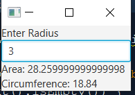

# result 


**view**
```xml
<?xml version="1.0" encoding="UTF-8"?>

<?import java.lang.*?>
<?import java.util.*?>
<?import javafx.scene.*?>
<?import javafx.scene.control.*?>
<?import javafx.scene.layout.*?>

<VBox id="AnchorPane"  xmlns:fx="http://javafx.com/fxml/1" fx:controller="bindingexercise6.FXMLDocumentController">
    <Label text="Enter Radius" />
    <TextField fx:id="txtRadius" text="0.0" />
    <Label fx:id="lblArea" text="Area: " />
    <Label fx:id="lblCir" text="Circumference: " />
</VBox>
```

**Circle.java**
```java
package bindingexercise6;

import javafx.beans.property.DoubleProperty;
import javafx.beans.property.SimpleDoubleProperty;

public class Circle {

    private final DoubleProperty radius = new SimpleDoubleProperty(this, "radius");

    public Circle() {
    }

    public final void setRadius(double radius) {
        if (radius >= 0) {
            this.radius.set(radius);
        } else {
            throw new IllegalArgumentException("Error: radius must be 0 or more.");
        }
    }

    public final double getRadius() {
        return radius.get();
    }

    public final DoubleProperty radiusProperty() {
        return radius;
    }

    @Override
    public String toString() {
        return String.format("Radius: %.1f", radius.get());
    }

}
```

**controller**
```java
package bindingexercise6;

import java.net.URL;
import java.util.ResourceBundle;
import javafx.beans.InvalidationListener;
import javafx.beans.Observable;
import javafx.beans.binding.NumberBinding;
import javafx.beans.property.SimpleStringProperty;
import javafx.event.ActionEvent;
import javafx.fxml.FXML;
import javafx.fxml.Initializable;
import javafx.scene.control.Label;
import javafx.scene.control.TextField;

public class FXMLDocumentController implements Initializable {

    @FXML
    private TextField txtRadius;

    @FXML
    private Label lblArea, lblCir;

    @FXML
    private void handleButtonAction(ActionEvent event) {
        System.out.println("You clicked me!");

    }

    private Circle circle = new Circle();

    @Override
    public void initialize(URL url, ResourceBundle rb) {

        txtRadius.textProperty().addListener(new InvalidationListener() {
            @Override
            public void invalidated(Observable observable) {
                if (!txtRadius.getText().isEmpty()) {
                    circle.setRadius(Double.parseDouble(txtRadius.getText()));
                }
            }
        });

        NumberBinding area = circle.radiusProperty().multiply(3.14).multiply(circle.radiusProperty());
        NumberBinding circumference = circle.radiusProperty().multiply(2).multiply(3.14);

        lblArea.textProperty().bind(new SimpleStringProperty("Area: ").concat(area.asString()));
        lblCir.textProperty().bind(new SimpleStringProperty("Circumference: ").concat(circumference.asString()));

    }

}
```