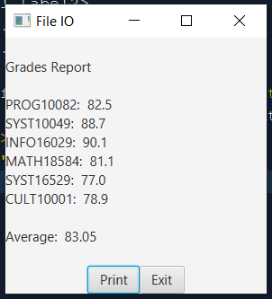

```xml
<?xml version="1.0" encoding="UTF-8"?>

<?import javafx.scene.control.Button?>
<?import javafx.scene.control.Label?>
<?import javafx.scene.layout.HBox?>
<?import javafx.scene.layout.VBox?>

<VBox prefHeight="285.0" prefWidth="290.0" xmlns:fx="http://javafx.com/fxml/1" xmlns="http://javafx.com/javafx/11.0.1" fx:controller="outputfileexercise2.FXMLDocumentController">
    <Label fx:id="lblReport" prefHeight="258.0" prefWidth="292.0" text="" />
    <HBox alignment="CENTER">
        <Button text="_Print" onAction="#print" />
        <Button text="E_xit" onAction="#exit" />
    </HBox>
</VBox>
```

```java
package outputfileexercise2;

import java.io.BufferedWriter;
import java.io.File;
import java.io.FileNotFoundException;
import java.io.FileWriter;
import java.io.IOException;
import java.io.PrintWriter;
import java.net.URL;
import java.util.ResourceBundle;
import java.util.Scanner;
import javafx.event.ActionEvent;
import javafx.fxml.FXML;
import javafx.fxml.Initializable;
import javafx.scene.control.Label;

public class FXMLDocumentController implements Initializable {

    @FXML
    private Label lblReport;

    @FXML
    private void print(ActionEvent event) throws IOException {
        File f = new File("./src/data/report.txt");
        FileWriter fw = new FileWriter(f, true);
        BufferedWriter bw = new BufferedWriter(fw);
        PrintWriter pw = new PrintWriter(bw);

        pw.print(lblReport.getText());
        pw.close();
    }

    @FXML
    private void exit(ActionEvent event) {
        System.exit(0);
    }

    @Override
    public void initialize(URL url, ResourceBundle rb) {
        try {
            Scanner input = new Scanner(new File("./src/data/data.txt"));
            String result = "Grades Report\n\n";

            int count = 0;
            double sum = 0;
            while (input.hasNextLine()) {
                String[] line = input.nextLine().split("\\s*\\|\\s*");
                count++;
                sum += Double.parseDouble(line[1]);
                result += line[0] + ":  " + line[1] + "\n";
            }

            double avg = sum / count;
            result += "\nAverage:  " + String.format("%.2f", avg);
            lblReport.setText(result);

        } catch (FileNotFoundException e) {
            System.out.println(e.getMessage());
        }
    }
}
```