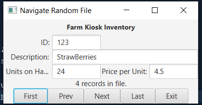

## FXMLDocument.fxml
```xml
<?xml version="1.0" encoding="UTF-8"?>

<?import javafx.scene.control.Button?>
<?import javafx.scene.control.Label?>
<?import javafx.scene.control.TextField?>
<?import javafx.scene.layout.ColumnConstraints?>
<?import javafx.scene.layout.GridPane?>
<?import javafx.scene.layout.HBox?>
<?import javafx.scene.layout.RowConstraints?>
<?import javafx.scene.layout.VBox?>
<?import javafx.scene.text.Font?>

<VBox alignment="CENTER" xmlns:fx="http://javafx.com/fxml/1" xmlns="http://javafx.com/javafx/11.0.1" fx:controller="kioskinventory.FXMLDocumentController">
    <Label alignment="CENTER" prefHeight="32.0" prefWidth="157.0" text="Farm Kiosk Inventory" textAlignment="CENTER">
      <font>
         <Font name="System Bold" size="14.0" />
      </font></Label>
    <GridPane>
      <rowConstraints>
         <RowConstraints minHeight="10.0" prefHeight="30.0" />
         <RowConstraints minHeight="10.0" prefHeight="30.0" />
         <RowConstraints minHeight="10.0" prefHeight="30.0" />
      </rowConstraints>
      <columnConstraints>
         <ColumnConstraints minWidth="10.0" prefWidth="100.0" />
         <ColumnConstraints minWidth="10.0" prefWidth="100.0" />
         <ColumnConstraints minWidth="10.0" prefWidth="100.0" />
         <ColumnConstraints minWidth="10.0" prefWidth="100.0" />
      </columnConstraints>
      <children>
         <Label alignment="CENTER_RIGHT" contentDisplay="RIGHT" prefHeight="18.0" prefWidth="95.0" text="ID:" textAlignment="RIGHT" />
         <Label alignment="CENTER_RIGHT" prefHeight="18.0" prefWidth="94.0" text="Description:" GridPane.rowIndex="1" />
         <Label alignment="CENTER_RIGHT" prefHeight="18.0" prefWidth="93.0" text="Units on Hand:" GridPane.rowIndex="2" />
         <Label alignment="CENTER_RIGHT" prefHeight="18.0" prefWidth="95.0" text="Price per Unit:" GridPane.columnIndex="2" GridPane.rowIndex="2" />
         <TextField fx:id="txtId" GridPane.columnIndex="1" />
         <TextField fx:id="txtDesc" GridPane.columnSpan="3" GridPane.columnIndex="1" GridPane.rowIndex="1" />
         <TextField fx:id="txtUnits" GridPane.columnIndex="1" GridPane.rowIndex="2" />
         <TextField fx:id="txtPrice" GridPane.columnIndex="3" GridPane.rowIndex="2" />
      </children></GridPane>
    <Label fx:id="lblRecords" text="records in file" />
    <HBox alignment="CENTER">
        <Button onAction="#first" prefHeight="26.0" prefWidth="70.0" text="First" />
        <Button onAction="#prev" prefHeight="26.0" prefWidth="74.0" text="Prev" />
        <Button onAction="#next" prefHeight="26.0" prefWidth="75.0" text="Next" />
        <Button onAction="#last" prefHeight="26.0" prefWidth="72.0" text="Last" />
        <Button onAction="#exit" prefHeight="26.0" prefWidth="68.0" text="Exit" />
    </HBox>
</VBox>
```

## FXMLDocumentController.java
```java
package kioskinventory;

import java.io.File;
import java.io.IOException;
import java.io.RandomAccessFile;
import java.net.URL;
import java.util.ResourceBundle;
import javafx.event.ActionEvent;
import javafx.fxml.FXML;
import javafx.fxml.Initializable;
import javafx.scene.control.Label;
import javafx.scene.control.TextField;

public class FXMLDocumentController implements Initializable {

    final int RECORD = 86;
    int id;
    String desc;
    int units;
    double price;
    int loc = 1;
    int last;

    @FXML
    private Label lblRecords;

    @FXML
    private TextField txtId, txtDesc, txtUnits, txtPrice;

    @FXML
    private void first(ActionEvent event) throws IOException {
        display(1);
    }

    @FXML
    private void prev(ActionEvent event) throws IOException {
        if (loc > 1) {
            loc--;
        }
        display(loc);
    }

    @FXML
    private void next(ActionEvent event) throws IOException {
        if (loc < last) {
            loc++;
        }
        display(loc);
    }

    @FXML
    private void last(ActionEvent event) throws IOException {
        display(last);
    }

    @FXML
    private void exit(ActionEvent event) {
        System.exit(0);
    }

    @Override
    public void initialize(URL url, ResourceBundle rb) {

        try {
            RandomAccessFile raf = new RandomAccessFile(new File("./src/data/data.txt"), "rw");
            last = (int) raf.length() / RECORD;
            lblRecords.setText("" + last + " records in file.");
            raf.close();
            display(1);
        } catch (Exception e) {
        }
    }

    public void display(int pos) throws IOException {
        RandomAccessFile raf = new RandomAccessFile(new File("./src/data/data.txt"), "rw");
        raf.seek(RECORD * (pos - 1));
        txtId.setText("" + raf.readInt());
        desc = "";
        for (int i = 0; i < 35; i++) {
            desc += String.valueOf(raf.readChar());
        }
        txtDesc.setText(desc);
        txtUnits.setText("" + raf.readInt());
        txtPrice.setText("" + raf.readDouble());

        raf.close();
    }

}
```