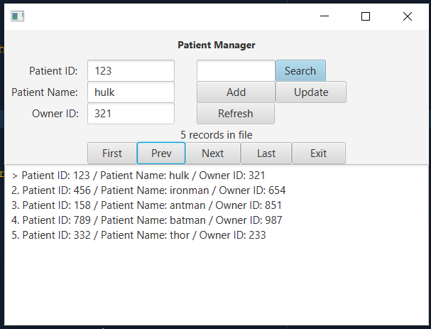

## FXMLDocument.fxml
```xml
<?xml version="1.0" encoding="UTF-8"?>

<?import javafx.scene.control.Button?>
<?import javafx.scene.control.Label?>
<?import javafx.scene.control.TextArea?>
<?import javafx.scene.control.TextField?>
<?import javafx.scene.layout.ColumnConstraints?>
<?import javafx.scene.layout.GridPane?>
<?import javafx.scene.layout.HBox?>
<?import javafx.scene.layout.RowConstraints?>
<?import javafx.scene.layout.VBox?>
<?import javafx.scene.text.Font?>

<VBox alignment="CENTER" xmlns="http://javafx.com/javafx/11.0.1" xmlns:fx="http://javafx.com/fxml/1" fx:controller="patientmanager.FXMLDocumentController">
   <Label alignment="CENTER" prefHeight="42.0" prefWidth="146.0" text="Patient Manager">
      <font>
         <Font name="System Bold" size="14.0" />
      </font>
   </Label>
    <GridPane prefHeight="95.0" prefWidth="478.0">
      <rowConstraints>
         <RowConstraints minHeight="10.0" prefHeight="30.0" />
         <RowConstraints minHeight="10.0" prefHeight="30.0" />
         <RowConstraints minHeight="10.0" prefHeight="30.0" />
      </rowConstraints>
      <columnConstraints>
         <ColumnConstraints maxWidth="131.4000244140625" minWidth="10.0" prefWidth="116.20001220703125" />
         <ColumnConstraints maxWidth="144.5999755859375" minWidth="10.0" prefWidth="122.59998779296876" />
         <ColumnConstraints maxWidth="89.4000244140625" minWidth="10.0" prefWidth="30.800012207031273" />
         <ColumnConstraints maxWidth="110.79998779296875" minWidth="10.0" prefWidth="110.79998779296875" />
         <ColumnConstraints minWidth="10.0" prefWidth="100.0" />
      </columnConstraints>
      <children>
         <Label alignment="CENTER_RIGHT" prefHeight="18.0" prefWidth="112.0" text="Patient ID:  " />
         <Label alignment="CENTER_RIGHT" prefHeight="18.0" prefWidth="108.0" text="Patient Name: " GridPane.rowIndex="1" />
         <Label alignment="CENTER_RIGHT" prefHeight="18.0" prefWidth="105.0" text="Owner ID:" GridPane.rowIndex="2" />
         <TextField fx:id="txtPId" GridPane.columnIndex="1" />
         <TextField fx:id="txtPName" GridPane.columnIndex="1" GridPane.rowIndex="1" />
         <TextField fx:id="txtOId" GridPane.columnIndex="1" GridPane.rowIndex="2" />
         <TextField fx:id="txtSearch" GridPane.columnIndex="3" />
         <Button fx:id="search" mnemonicParsing="true" onAction="#search" text="_Search" GridPane.columnIndex="4" defaultButton="true"/>
         <Button fx:id="update" mnemonicParsing="true" onAction="#update" prefHeight="26.0" prefWidth="115.0" text="_Update" GridPane.columnIndex="4" GridPane.rowIndex="1" />
         <Button fx:id="add" mnemonicParsing="true" onAction="#add" prefHeight="26.0" prefWidth="111.0" text="_Add" GridPane.columnIndex="3" GridPane.rowIndex="1" />
         <Button onAction="#refresh" mnemonicParsing="true" prefHeight="26.0" prefWidth="110.0" text="_Refresh" GridPane.columnIndex="3" GridPane.rowIndex="2" />
      </children></GridPane>
    <Label fx:id="lblRecords" text="3 records in file" />
    <HBox alignment="CENTER">
        <Button mnemonicParsing="true" fx:id="first" onAction="#first" prefHeight="26.0" prefWidth="70.0" text="_First" /> 
        <Button mnemonicParsing="true" fx:id="prev" onAction="#prev" prefHeight="26.0" prefWidth="68.0" text="_Prev" /> 
        <Button mnemonicParsing="true" fx:id="next" onAction="#next" prefHeight="26.0" prefWidth="78.0" text="_Next" /> 
        <Button mnemonicParsing="true" fx:id="last" onAction="#last" prefHeight="26.0" prefWidth="72.0" text="_Last" /> 
        <Button mnemonicParsing="true" fx:id="exit" onAction="#exit" prefHeight="26.0" prefWidth="76.0" text="_Exit" /> 
    </HBox>
    <TextArea fx:id="txtOutput" editable="false" />
</VBox>
```

## FXMLDocumentController.java
```java
package patientmanager;

import java.io.File;
import java.io.IOException;
import java.io.RandomAccessFile;
import java.net.URL;
import java.util.ResourceBundle;
import javafx.event.ActionEvent;
import javafx.fxml.FXML;
import javafx.fxml.Initializable;
import javafx.scene.control.Alert;
import javafx.scene.control.Label;
import javafx.scene.control.TextArea;
import javafx.scene.control.TextField;

public class FXMLDocumentController implements Initializable {

    final int RECORDS = 68;
    int pId;
    String pName;
    int oId;
    int pos = 0;
    int last;
    String search;

    @FXML
    private TextField txtPId, txtPName, txtSearch, txtOId;

    @FXML
    private Label lblRecords;

    @FXML
    private TextArea txtOutput;

    @FXML
    private void search(ActionEvent event) throws IOException {
        search = txtSearch.getText().toLowerCase();
        RandomAccessFile raf = new RandomAccessFile(new File("./src/data/data.txt"), "rw");
        raf.seek(0);
        int foundIndex = 0;
        for (int i = 0; i < last; i++) {
            pId = raf.readInt();
            pName = "";
            for (int j = 0; j < 30; j++) {
                pName += String.valueOf(raf.readChar());
            }
            oId = raf.readInt();
            String pattern = ".*" + search + ".*";
            // todo: change to combobox (add pId, pId)
            if (pName.trim().toLowerCase().matches(pattern)) {
                foundIndex = i + 1;
            }

            if (foundIndex != 0) {
                displayTxtField(foundIndex);
                pos = foundIndex;
                displayTextArea();
            }
        }

    }

    @FXML
    private void add(ActionEvent event) throws IOException {

        if ("".equals(txtPId.getText()) || "".equals(txtPName.getText()) || "".equals(txtOId.getText())) {
            Alert alert = new Alert(Alert.AlertType.INFORMATION);
            alert.setContentText("empty field is not accepted");
            alert.showAndWait();
        } else {
            write(last * RECORDS);
            pos = last;
            refresh();
        }
    }

    @FXML
    private void update(ActionEvent event) throws IOException {
        if ("".equals(txtPId.getText()) || "".equals(txtPName.getText()) || "".equals(txtOId.getText())) {
            Alert alert = new Alert(Alert.AlertType.INFORMATION);
            alert.setContentText("any record is not selected");
            alert.showAndWait();
        } else {

            if (pos > 0) {
                write((pos - 1) * RECORDS);
                refresh();
            }
        }
    }

    @FXML
    private void refresh(ActionEvent event) throws IOException {
        pos = 0;
        txtPId.setText("");
        txtPName.setText("");
        txtOId.setText("");
        refresh();
    }

    @FXML
    private void first(ActionEvent event) throws IOException {
        pos = 1;
        displayTxtField(1);
        displayTextArea();
    }

    @FXML
    private void prev(ActionEvent event) throws IOException {
        if (pos != 0 && pos > 1) {
            pos--;
        }
        displayTxtField(pos);
        displayTextArea();
    }

    @FXML
    private void next(ActionEvent event) throws IOException {
        if (pos != 0 && pos < last) {
            pos++;
        }
        displayTxtField(pos);
        displayTextArea();
    }

    @FXML
    private void last(ActionEvent event) throws IOException {
        pos = last;
        displayTxtField(last);
        displayTextArea();
    }

    @FXML
    private void exit(ActionEvent event) {
        System.exit(0);
    }

    @Override
    public void initialize(URL url, ResourceBundle rb) {
        try {
            displayLblOutput();
            if (last > 0) {
                pos = 1;
                displayTxtField(pos);
            }
            displayTextArea();
        } catch (Exception e) {
        }
    }

    public void write(long loc) throws IOException {
        RandomAccessFile raf = new RandomAccessFile(new File("./src/data/data.txt"), "rw");
        raf.seek(loc);

        raf.writeInt(Integer.parseInt(txtPId.getText()));
        pName = txtPName.getText();
        int s = 30 - pName.length();
        for (int i = 0; i < s; i++) {
            pName += " ";
        }
        raf.writeChars(pName);
        raf.writeInt(Integer.parseInt(txtOId.getText()));
        last = (int) raf.length() / RECORDS;
        raf.close();
    }

    public void displayTxtField(int p) throws IOException {
        RandomAccessFile raf = new RandomAccessFile(new File("./src/data/data.txt"), "rw");
        raf.seek(RECORDS * (p - 1));

        txtPId.setText("" + raf.readInt());
        pName = "";
        for (int i = 0; i < 30; i++) {
            pName += String.valueOf(raf.readChar());
        }
        txtPName.setText(pName.trim());
        txtOId.setText("" + raf.readInt());
        raf.close();
    }

    public void displayTextArea() throws IOException {
        RandomAccessFile raf = new RandomAccessFile(new File("./src/data/data.txt"), "rw");
        raf.seek(0);
        String result = "";
        for (int i = 0; i < last; i++) {
            String number = "";
            if ((i + 1) == pos) {
                number = ">";
            } else {
                number = "" + (i + 1) + ".";
            }
            pId = raf.readInt();
            pName = "";
            for (int j = 0; j < 30; j++) {
                pName += String.valueOf(raf.readChar());
            }
            oId = raf.readInt();
            result += String.format("%s Patient ID: %d / Patient Name: %s / Owner ID: %d%n", number, pId, pName.trim(), oId);
        }
        txtOutput.setText(result);
    }

    public void displayLblOutput() throws IOException {
        RandomAccessFile raf = new RandomAccessFile(new File("./src/data/data.txt"), "rw");
        last = (int) raf.length() / RECORDS;
        lblRecords.setText("" + last + " records in file");
        raf.close();
    }

    public void refresh() throws IOException {
        displayTextArea();
        displayLblOutput();
    }

}
```

## PatientManager.java
```java
package patientmanager;

import javafx.application.Application;
import javafx.fxml.FXMLLoader;
import javafx.scene.Parent;
import javafx.scene.Scene;
import javafx.stage.Stage;

public class PatientManager extends Application {
    
    @Override
    public void start(Stage stage) throws Exception {
        Parent root = FXMLLoader.load(getClass().getResource("FXMLDocument.fxml"));
        
        Scene scene = new Scene(root);
        
        stage.setScene(scene);
        stage.show();
    }

    public static void main(String[] args) {
        launch(args);
    }
    
}
```