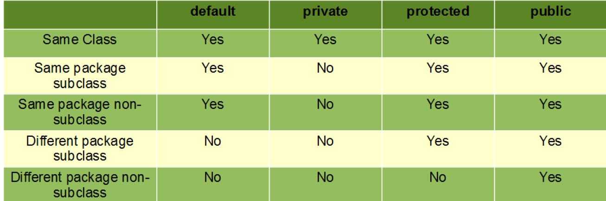
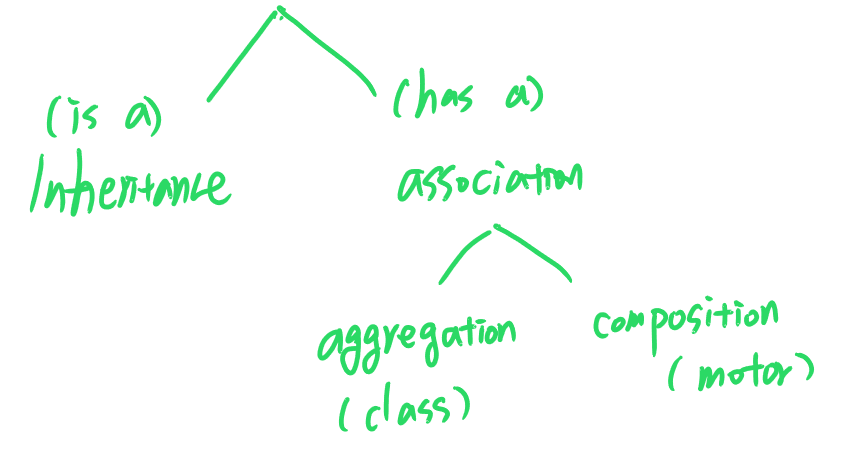
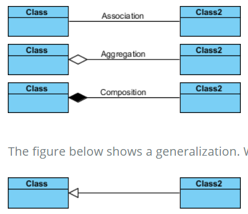
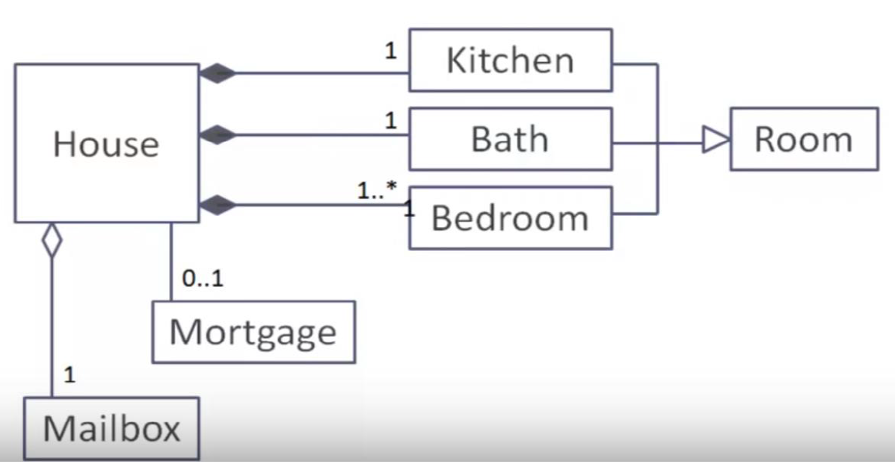

[UML Association vs Aggregation vs Composition](https://www.visual-paradigm.com/guide/uml-unified-modeling-language/uml-aggregation-vs-composition/)
- Inheritance : is a
- Composition : has a

- Aggregation : An association between classes representing a  part-to-whole relationship in which the parts and the whole may exist independently and in which a single part may be associated with more than one whole at the same time.
- Composition : An association between classes representing a whole-to-part relationship in which the parts  may belong to only one whole at a time and the  whole does not exist without its parts.

- Create a simple program with 3 classes: program, employee and manager
- Create two implementations for calculatePay
- Employee.calculatePay() = hours * wage
- Manager.calculatePay() = hours * wage + bonus
- In the main method create an Employee object and a Manager object
- Calculate and print their paycheque
- A Manager is an Employee 
- An Employee has a name, a wage and numHours
- A Manager has all of the above plus a bonus
- Both have methods to calculatePay but implementations are different
- The Program class defines the main method which creates an Employee and a Manager and then prints out each of their pay.
  
## Program.java
```java
package employeeDetails;

public class Program {
    public static void main(String[] args) {
        Employee e = new Employee("abc", 14, 35);
        Manager m = new Manager("xyz",25, 54, 23);
        
        System.out.println("Employee : " + e.calculatePay());
        System.out.println("Manager : "  + m.calculatePay());
    }
}
```

# Employee.java
```java
package employeeDetails;

public class Employee {

    private String name;
    private double wage;
    private double noofhours;

    public Employee(String name, double wage, double noofhours) {
        this.name = name;
        this.wage = wage;
        this.noofhours = noofhours;
    }

    public String getName() {
        return this.name;
    }
    public void setName(String name) {
        this.name = name;
    }

    public double getWage() {
        return this.wage;
    }

    public void setWage(double wage) {
        this.wage = wage;
    }

    public double getNoofhours() {
        return this.noofhours;
    }

    public void setNoofhours(double noofhours) {
        this.noofhours = noofhours;
    }

    public double calculatePay() {
        return wage * noofhours;
    }
}
```

# Manager.java
```java
package employeeDetails;

public class Manager extends Employee {

    private double bonus;

    public Manager(String name, double wage, double noofhours, double bonus) {
        super(name, wage, noofhours);
        this.bonus = bonus;
    }

    public double getBonus() {
        return this.bonus;
    }

    public void setBonus(double bonus) {
        this.bonus = bonus;
    }

    @Override
    public double calculatePay() {
        return (super.calculatePay() + bonus);
    }
}
```

