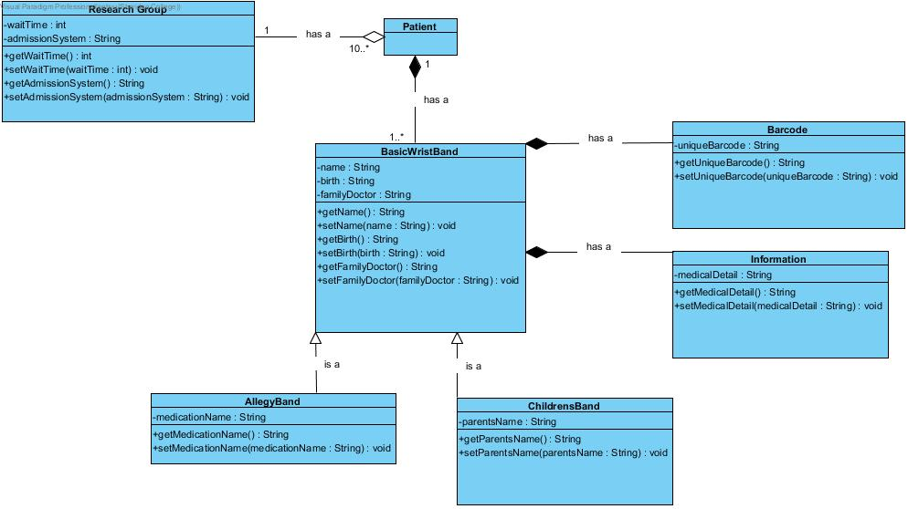

- An online admissions service in a hospital emergency department has several tasks. It is responsible for printing patient wrist bands upon admission. The basic wrist bands are assigned to one patient and a patient may have multiple wrist bands depending on their needs when admitted. The basic wrist band lists the patient’s name, date of birth and family doctor. There are several other types of wrist bands which include but are not limited to allergy wrist bands which have all of the basic wrist band criteria plus the name of any medications the patients are allergic to and children’s wrist bands which have the basic wrist band criteria and also list the name of an accompanying parent. Each wrist band can be broken into two parts: the bar code section which contains a unique bar code and the information section, containing specific medical details about the patient.  
- Patients in the ER are also occasionally asked to participate in research groups to evaluate wait times and the admissions system also tracks these groups. The wait times group consists of 10 or more patients and tracks how long they wait in the waiting room prior to admission. A patient can be in only one research group at one time. 

