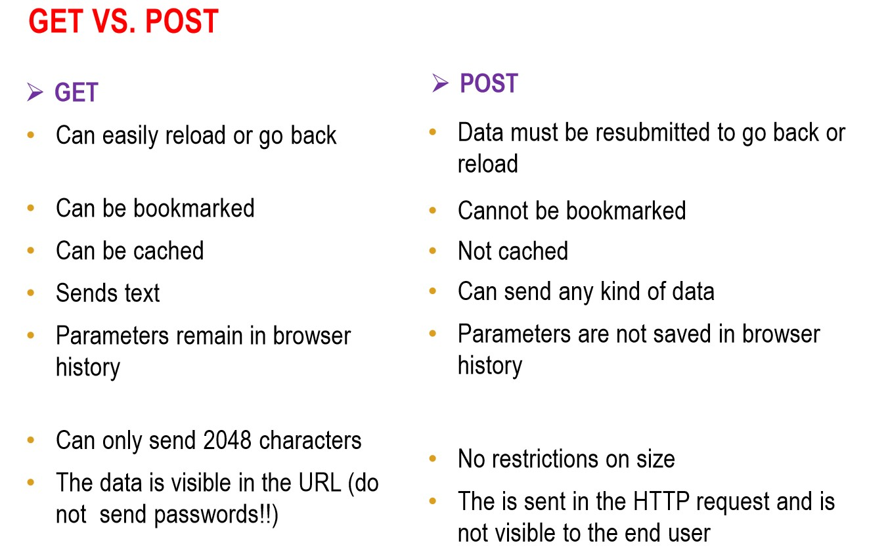
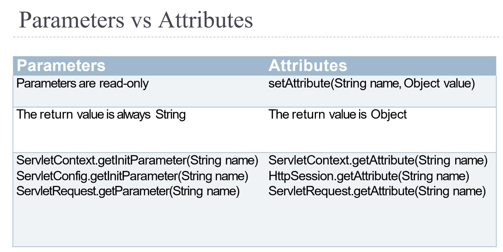
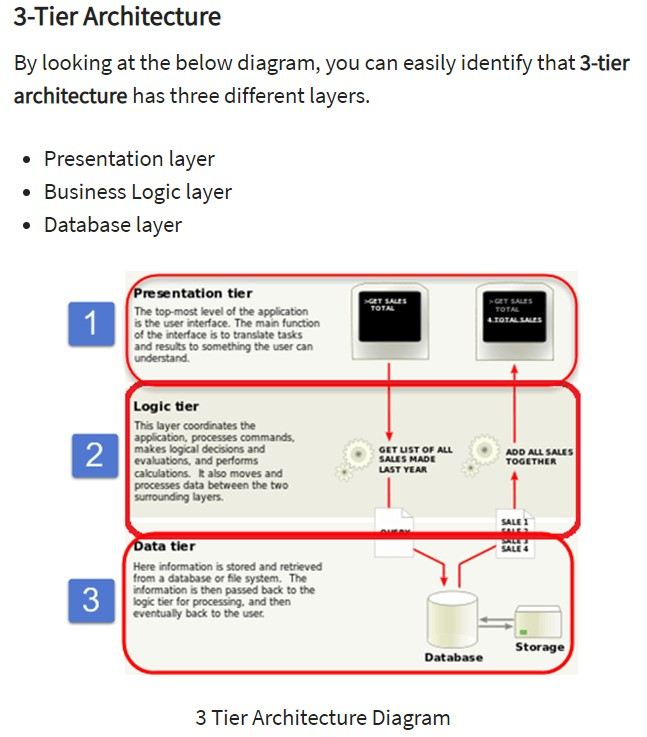
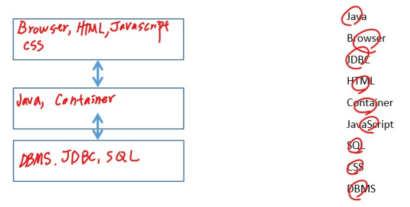
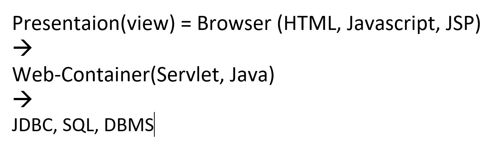

## term
> deployment descriptor (web.xml)
>   - welcome files, servlet names and descriptions, error pages  

> servlet annotation
>   - @WebServlet("URLPattern")
>   - @WebServlet( { “/AnnotationTest”, “/SayHello” } ) 
>   - @WebServlet(name = "ThisIsTheServletNameNotTheURL", description = "This is our servlet description", urlPatterns= {"/AnnotationTest", "/SayHello"}, asyncSupported= false )

## source
```java
res.setContentType("text/html"); 
PrintWriter out = res.getWriter(); 
out.println("<HTML><HEAD><TITLE>Hello World!</TITLE>"+ 
"</HEAD><BODY>Hello World!</BODY></HTML>"); 
out.close();
```
## POJO & JavaBeans

## GET vs post

[GET vs POST](https://www.diffen.com/difference/GET-vs-POST-HTTP-Requests)

## Shortly describe three cases when GET method cannot (should not) be used in forms
- password, sin number, too much long contents

## getParameter vs getAttribute


## redirect vs dispatch
1. redirect
   - response.sendRedirect("test");
   - request는 못 넘김, 단지 page만 이동
   - request를 수정하면 redirect를 할 수 없다.
   - 이동 후의 request는 전혀 다른 객체이다.
   - 작업이 클라이언트에서 발생
   - url이 변경된다. 

2. dispatch
   - request.getRequestDispatcher("testDispatch2").forward(request, response);
   - getServletContext().getRequestDispatcher("testDispatch2").forward(request, response);
   - request 자체를 넘기는 방식
   - 작업이 서버에서 발생
   - url 변경 안됨 (최소 호출한 url이 그대로 있음) 

## For each of the following Servlet methods, state when each method is called?  
[lifecyle](https://www.tutorialspoint.com/servlets/servlets-life-cycle.htm)

## Consider the two different lines of Java code below… 
```java 
 s1 = Connection.createStatement();    
 s2 = Connection.prepareStatement("SELECT * FROM myTable WHERE userid=?;"); 
```

1. Write the appropriate declarations for the variables s1 and s2 used above. 
```java
Statement s1 = null;
PreparedStatement s2 = null;
```

2. Write the Java code necessary to execute an SQL statement using s1 as defined above, storing the result of the query in a variable of the appropriate type. The statement to execute is: SELECT * FROM myTable WHERE userid='RobertSmith'; 
```java
String query = "SELECT * FROM myTable WHERE userid='RobertSmith'";
ResultSet rs = s1.executeQuery(query);
```
  
3. Write the Java code necessary to execute the same SQL statement from part b, using s2 as defined above, storing the result of the query in a variable of the appropriate type 
```java
s2.setInt(1, 13);
ResultSet rs = s2.executeQuery();
```

## It is often a good idea to develop large-scale enterprise web applications according to the principles of multi-tier architecture. 
 
1. Explain one important benefit of structuring the code this way
   - Advantages
      - Scalability
      - Data Integrity
      - Reusability
      - Reduced Distribution
      - Improved Security
      - Improved Availability
 
2. Explain one possible drawback. 
   - Disadvantages
      - Increase in Effort
      - Increase in Complexity 

## You can think of a Java web app as having three main tiers (with each tier possibly further broken into other layers or sub-tiers). 
 
1. Name the three main tiers on the diagram below. 
   - 3-Tier Architecture
  

 
1. Draw a line connecting each of the technologies on the right to the one main tier they help to implement in a Java Web App. 


