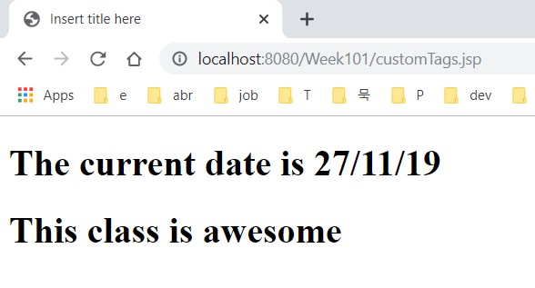
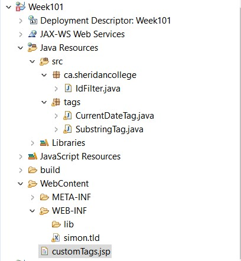

## customTags.jsp
```jsp
<%@ page language="java" contentType="text/html; charset=ISO-8859-1"
    pageEncoding="ISO-8859-1"%>
<%@ taglib prefix="custom" uri="WEB-INF/simon.tld" %>
<!DOCTYPE html PUBLIC "-//W3C//DTD HTML 4.01 Transitional//EN" "http://www.w3.org/TR/html4/loose.dtd">
<html>
<head>
<meta http-equiv="Content-Type" content="text/html; charset=ISO-8859-1">
<title>Insert title here</title>
</head>
<body>
	<h1>The current date is <custom:currentDate /></h1>
	<h1>This class is <custom:substring input="Absolutely awesome!!!!" start="11" end="18" /></h1>
</body>
</html>
```

## CurrentDateTag.java
```java
package tags;

import java.io.IOException;
import java.text.DateFormat;
import java.util.Date;

import javax.servlet.jsp.JspException;
import javax.servlet.jsp.JspWriter;
import javax.servlet.jsp.tagext.TagSupport;

public class CurrentDateTag extends TagSupport {

	public int doStartTag() throws JspException {

		// the work
		Date currentDate = new Date();
		DateFormat shortDate = DateFormat.getDateInstance(DateFormat.SHORT);
		String currentDateFormatted = shortDate.format(currentDate);

		// the output
		JspWriter out = pageContext.getOut();
		try {
			out.print(currentDateFormatted);
		} catch (IOException e) {
			// TODO Auto-generated catch block
			e.printStackTrace();
		}

		// tell Java to skip the body of this tag
		return SKIP_BODY;

	}

}
```

## SubstringTag.java
```java
package tags;

import java.io.IOException;

import javax.servlet.jsp.JspException;
import javax.servlet.jsp.JspWriter;
import javax.servlet.jsp.tagext.TagSupport;

public class SubstringTag extends TagSupport {

	private String input;
	private int start;
	private int end;

	public String getInput() {
		return input;
	}

	public void setInput(String input) {
		this.input = input;
	}

	public int getStart() {
		return start;
	}

	public void setStart(int start) {
		this.start = start;
	}

	public int getEnd() {
		return end;
	}

	public void setEnd(int end) {
		this.end = end;
	}

	public int doStartTag() throws JspException {
		JspWriter out = pageContext.getOut();
		try {
			out.println(input.substring(start, end));
		} catch (IOException e) {
			// TODO Auto-generated catch block
			e.printStackTrace();
		}

		return SKIP_BODY;
	}

}

```

## simon.tld
```xml
<?xml version="1.0" encoding="UTF-8"?>
<taglib version="2.0" xmlns="http://java.sun.com/xml/ns/j2ee"
	xmlns:xsi="http://www.w3.org/2001/XMLSchema-instance"
	xsi:schemaLocation="http://java.sun.com/xml/ns/j2ee web-jsptaglibrary_2_0.xsd">
	<tlib-version>1.0</tlib-version>
	<info>A custom tag library developed by Simon Hood</info>
	<uri>/WEB-INF/simon.tld</uri>

	<tag>
		<name>currentDate</name>
		<tagclass>tags.CurrentDateTag</tagclass>
	</tag>

	<tag>
		<name>substring</name>
		<tagclass>tags.SubstringTag</tagclass>
		<attribute>
			<name>input</name>
			<required>true</required>
		</attribute>
		<attribute>
			<name>start</name>
			<required>true</required>
		</attribute>
		<attribute>
			<name>end</name>
			<required>true</required>
		</attribute>
	</tag>
</taglib>

```