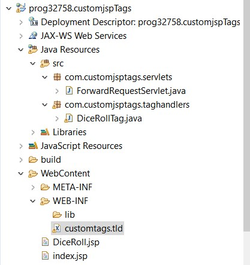

## index.jsp
```jsp
<%@ page language="java" contentType="text/html; charset=ISO-8859-1"
	pageEncoding="ISO-8859-1"%>
<!DOCTYPE html>
<html>
<head>
<meta charset="ISO-8859-1">
<title>Example 1: Rolling Dice</title>
</head>
<body>
	<form method="post" action="ForwardRequest.do">
		<input type="submit" value="Role Dice"> 
		<input type="hidden" value="/DiceRoll.jsp" name="jsp_file">
	</form>
</body>
</html>
```

## ForwardRequestServlet.java
```java
package com.customjsptags.servlets;

import java.io.IOException;
import javax.servlet.ServletException;
import javax.servlet.annotation.WebServlet;
import javax.servlet.http.HttpServlet;
import javax.servlet.http.HttpServletRequest;
import javax.servlet.http.HttpServletResponse;

@WebServlet("/ForwardRequest.do")
public class ForwardRequestServlet extends HttpServlet {
	private static final long serialVersionUID = 1L;

	public ForwardRequestServlet() {
	}

	protected void doGet(HttpServletRequest request, HttpServletResponse response)
			throws ServletException, IOException {
		String file = request.getParameter("jsp_file");
		request.getRequestDispatcher(file).forward(request, response);
	}

	protected void doPost(HttpServletRequest request, HttpServletResponse response)
			throws ServletException, IOException {
		doGet(request, response);
	}
}
```

## DiceRoll.jsp
```jsp
<%@ page language="java" contentType="text/html; charset=ISO-8859-1"
	pageEncoding="ISO-8859-1"%>
<%@ taglib prefix="custom" uri="/WEB-INF/customtags.tld"%>
<!DOCTYPE html>
<html>
<head>
<meta charset="ISO-8859-1">
<title>Simulate a Roll of the Dice</title>
</head>
<body>
	<h1>
		<custom:diceRoll>
		</custom:diceRoll>
	</h1>
</body>
</html>
```

## DiceRollTag.java
```java
package com.customjsptags.taghandlers;

import java.io.IOException;
import java.util.Date;
import java.util.Random;

import javax.servlet.jsp.JspException;
import javax.servlet.jsp.JspWriter;
import javax.servlet.jsp.tagext.TagSupport;

public class DiceRollTag extends TagSupport {
	private int numDice = 2;

	public int getNumDice() {
		return numDice;
	}

	public void setNumDice(int numDice) {
		this.numDice = numDice;
	}
  
	public int doStartTag() throws JspException {
		// the work
		Date currentDate = new Date();
		Random r = new Random();
		int total = 0;
		int number;
		JspWriter out = pageContext.getOut();
		for (int i = 1; i < numDice; i++) {
			number = r.nextInt(6) + 1;
			total += number;

			try {
				out.print("<h1> Dice" + i + " face = " + number);
				number = r.nextInt(6) + 1;
				total += number;
			} catch (IOException e) {
				// TODO Auto-generated catch block
				e.printStackTrace();
			}
		}
		try {
			out.print("<h1> the sum of both rollings = " + total);
		} catch (IOException e) {
			// TODO Auto-generated catch block
			e.printStackTrace();
		}
		// a constant telling Java to skip the body of this tag
		return SKIP_BODY;

	}
}
```

## customtags.tld
```xml
<?xml version="1.0" encoding="UTF-8"?>
<taglib version="2.0" xmlns="http://java.sun.com/xml/ns/j2ee"
	xmlns:xsi="http://www.w3.org/2001/XMLSchema-instance"
	xsi:schemaLocation="http://java.sun.com/xml/ns/j2ee webjsptaglibrary_2_0.xsd">
	<tlib-version>1.0</tlib-version>
	<info>A custom tag library developed by Ahmad Soleimani</info>
	<uri>/WEB-INF/customtags.tld</uri>
	<tag>
		<name>diceRoll</name>
		<tagclass>com.customjsptags.taghandlers.DiceRollTag</tagclass>
		<attribute>
			<name>numDice</name>
			<required>false</required>
			<rtexprvalue>true</rtexprvalue>
		</attribute>
	</tag>

</taglib>

```